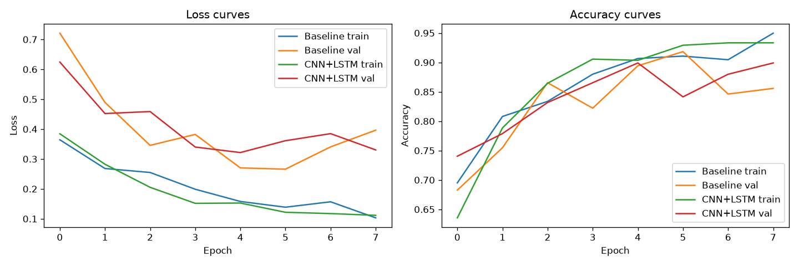
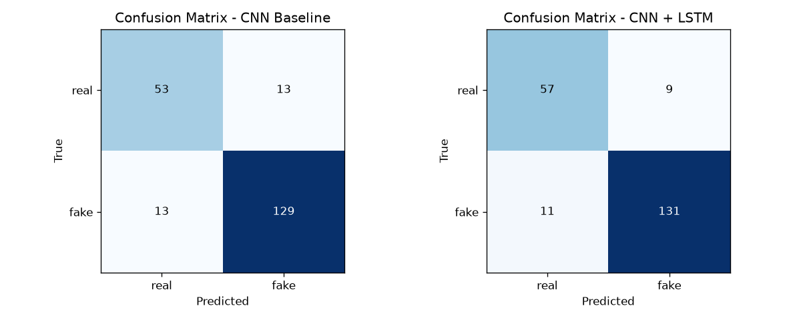

# AI-Generated Video Detection with CNN Features and LSTM Temporal Modeling

Detects deepfake (AI-manipulated) face videos. Each clip is sampled into 8 frames, the face is cropped, a pretrained ResNet-18 extracts per-frame features, and an LSTM models how those features change over time.

A frame-level CNN baseline is trained on the same data for comparison.

Final Deep Learning course project by Fuadkhan Safarov.

## Results

Held-out test set of 208 videos (66 real, 142 fake). Final run: [`analysis/2026-09-11_v2`](analysis/2026-09-11_v2).

| Metric    | CNN baseline | CNN + LSTM (tuned) |
|-----------|:------------:|:------------------:|
| Accuracy  | 87.5%        | **90.4%**          |
| Precision | 90.8%        | **93.6%**          |
| Recall    | 90.8%        | **92.3%**          |
| F1        | 90.8%        | **92.9%**          |
| ROC-AUC   | 0.928        | **0.964**          |

Precision, recall and F1 are reported for the *fake* class.

| Training curves | Confusion matrices |
|---|---|
|  |  |

Results come from single training runs. GPU non-determinism moved the baseline by a few points between otherwise identical runs, so small differences should be read with care.

### How the results evolved

Each row changed one thing and measured the effect. All snapshots are in [`analysis/`](analysis).

| Run | Videos | Face crop | LSTM tuned for this pipeline | Baseline acc / AUC | LSTM acc / AUC |
|---|---|---|---|---|---|
| 2026-09-09_v1 | 400 | no | yes | 64.4% / 0.52 | 32.2% / 0.48 (checkpoint bug) |
| 2026-09-10_v1 | 1390 | no | reused | 61.1% / 0.668 | 60.6% / 0.698 |
| 2026-09-11_v1 | 1390 | yes | reused | 91.3% / 0.951 | 87.0% / 0.936 |
| **2026-09-11_v2** | **1390** | **yes** | **yes** | **87.5% / 0.928** | **90.4% / 0.964** |

Main lessons:

- **Face cropping was the biggest single gain.** It raised ROC-AUC from about 0.7 to above 0.93, because manipulation artifacts live in the face region.
- **More data helped, but only to a point.** Going from 400 to 1390 videos moved ROC-AUC off chance level but plateaued without face cropping.
- **Hyperparameters did not transfer across pipelines.** With settings tuned on the old pipeline the LSTM lost to the baseline. Re-tuning on the face-cropped pipeline (hidden size 256 instead of 128) made it win on every metric.
- **A checkpoint bug hid early progress.** The best model was saved at the first epoch with low validation loss. A two-epoch warm-up before checkpointing fixed it.

## Method

```
video ─► sample 8 frames ─► YuNet face detection (middle frame, 30% padding)
      ─► crop + resize to 224×224 ─► ImageNet normalization
      ─► ResNet-18 (ImageNet-pretrained) per frame
           ├─ Baseline: per-frame logit, averaged over frames
           └─ CNN+LSTM: 512-d features ─► LSTM (hidden 256) ─► dropout ─► linear ─► logit
```

- **Decoding** uses `decord`, about 2.8× faster than OpenCV for sparse frame sampling.
- **Class imbalance** is handled with a weighted random sampler plus a positive-class weight in `BCEWithLogitsLoss`.
- **Augmentation** is a random horizontal flip and light brightness/contrast jitter on training data only.
- **Training** uses Adam, up to 8 epochs, early stopping with patience 3, and a 70/15/15 train/val/test split with seed 42.
- **Tuning** compares three LSTM configurations for 2 epochs each and keeps the lowest validation loss.

## Dataset

1390 videos: 440 real and 950 fake. Videos are not included in this repository.

- **DFDC sample set** (`train_sample_videos`, 400 videos) from the Kaggle Deepfake Detection Challenge. `sort_dfdc_sample.py` splits it into `data/real` and `data/fake` using its `metadata.json`.
- **DeepFake Detection (DFD)** by Google/Jigsaw, from the Kaggle dataset `sanikatiwarekar/deep-fake-detection-dfd-entire-original-dataset`. Its files were added to the same folders with a `dfd_` prefix.
- All real videos were kept. Fake videos were randomly trimmed to 950 to limit training time.

```bash
kaggle datasets download -d sanikatiwarekar/deep-fake-detection-dfd-entire-original-dataset
```

Expected layout:

```
data/
├── real/   *.mp4
└── fake/   *.mp4
```

## Repository structure

```
AI_Video_Detection_Project.ipynb         Main notebook: full write-up, code, analysis and discussion
AI_Video_Detection_Project_Kaggle.ipynb  Variant that reads DFDC data from /kaggle/input (unused fallback)
run_facecrop_pipeline_v2_tuned.py        Script that produced the final results (tuning + both models)
run_facecrop_pipeline.py                 Previous run (2026-09-11_v1), without re-tuning
predict.py                               Classify any video with a trained model
checkpoints/                             Final trained weights (CNN+LSTM and baseline, ~45 MB each)
sort_dfdc_sample.py                      Sorts the DFDC sample set into data/real and data/fake
analysis/<date>_vN/                      Metrics, plots, reports and logs for each training run
presentation_script.md                   Script for the project video presentation
requirements.txt                         Python dependencies
```

Not tracked by git: `data/`, intermediate checkpoints, `face_detector_model/`, and the virtual environment.

## Setup

Tested with Python 3.14 on Windows 11 with an NVIDIA GPU (CUDA 12.8).

```bash
python -m venv venv
venv\Scripts\activate            # Linux/macOS: source venv/bin/activate

# Install PyTorch for your CUDA version first, for example:
pip install torch torchvision --index-url https://download.pytorch.org/whl/cu128
pip install -r requirements.txt
```

The YuNet face detector (`face_detection_yunet_2023mar.onnx`, from the OpenCV model zoo) is downloaded automatically by the notebook and by `predict.py` on first run.

## Usage

**Predict on a single video.** The final trained weights are included in `checkpoints/`, so this works right after cloning.

```bash
python predict.py path/to/video.mp4                   # CNN + LSTM (default)
python predict.py path/to/video.mp4 --model baseline  # CNN baseline
```

**Retrain from scratch.** Prepare `data/` as described above, then run:

```bash
python run_facecrop_pipeline_v2_tuned.py
```

This took about 2.75 hours on the development machine. The training script expects the YuNet model in `face_detector_model/` and does not download it, so run the notebook's setup cells or `predict.py` once first. Outputs go to `checkpoints/` and `analysis/2026-09-11_v2/`.

**Notebook.** Open `AI_Video_Detection_Project.ipynb` for the full write-up. Stored results are in `analysis/`, so the notebook can be read without re-running training.

## Known issues

- **Import order on Windows.** Importing `decord` before `torch` breaks PyTorch's DLL loading. All scripts import `torch` first. Keep it that way.
- **`jupyter nbconvert --execute` crashes** with "DataLoader worker exited unexpectedly" on Windows when `NUM_WORKERS > 0`. Run training as a plain Python script, or set `NUM_WORKERS = 0` in the notebook.
- **OpenCV 5** removed the older Caffe and Haar face detectors, so only YuNet is supported.

## Limitations

- Small dataset by deepfake-detection standards, drawn from two sources with mostly static talking-head clips.
- Face detection runs once per clip, so fast head motion or multiple faces may be cropped poorly.
- No cross-dataset evaluation yet, so generalization to other generators (for example Celeb-DF or diffusion-based video) is untested.

## License

Released under the [MIT License](LICENSE).
